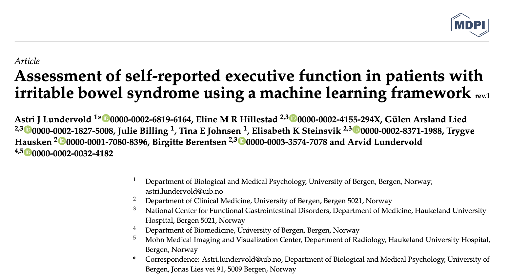

# BRIEF-IBS

LAST UPDATED: [Arvid Lundervold](https://www.uib.no/en/persons/Arvid.Lundervold), 2023-05-30

Code accompanying the paper "Assessment of self-reported executive function in irritable bowel syndrome using a machine learning framework"<br>
Accepted 27 May 2023, to appear in _Journal of Clinical Medicine_, 2023. <br>
Overleaf: https://www.overleaf.com/project/64633e1ad925e61795ca94f4 (restricted access)





### The conda environment:

- [`pycaret3`](./environment.yml)

### The notebooks:

- [1-eda-brief.ipynb](./1-eda-brief.ipynb) - Exploratory Data Analysis of the [BRIEF-A](https://www.parinc.com/Products/Pkey/25) data
- [2-ml-brief.ipynb](./2-ml-brief.ipynb) - Analysis using Machine Learning ([PyCaret 3.0](https://pycaret.gitbook.io/docs))

----

### Installation and maintenence

```bash
# To clone the repository (once)
git clone git@github.com:MMIV-ML/BRIEF-IBS.git

# To install environment (once)
conda env update -f environment.yml
conda activate pycaret3

# back to (base)
conda deactivate   # back to (base)

# To update the pycaret3 environment (if new versions become available):
conda update -n pycaret3 --all      # To update all packages in the named environment

# To remove and reinstall the pycaret environment (if installation problems):
conda deactivate
conda env remove -n pycaret3
#   <fix iinstallation>
# e.g. pip install --upgrade pycaret
# Then, recreate the conda environment pycaret3 as above:
conda env update -f environment.yml
conda activate pycaret3

## OPTIONAL: To install a jupyter kernel PYCARET3
python -m ipykernel install --user --name pycaret3 --display-name "PYCARET3"
```
